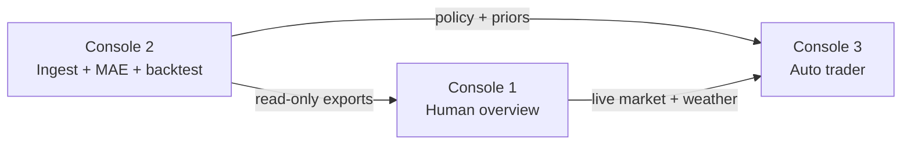

# Mission

## Mission statement

Build and operate a **Kalshi KMIA daily-maximum-temperature betting system** grounded in verified weather data, historical forecast accuracy, and disciplined risk controls — so a human operator can oversee live markets with confidence and automated strategies can act only when edge, liquidity, and policy constraints align.

The program treats **NDFD as forecast** and **NCEI/ISD as observed truth**. It never substitutes simulated or proxy weather for real archive data in backtests or settlement logic.

---

## Program objective

1. **Ingest and preserve** a multi-year KMIA NDFD + observation archive (NAS raw lake → Legion5 extracts).
2. **Quantify forecast precision** — MAE, bracket hit-rates, lead-time behavior — and publish research artifacts operators can trust.
3. **Backtest Kalshi price history** against that weather truth at a fixed decision anchor (prior-day 10 AM ET).
4. **Export trading policy** (edge rules, maker limits, insurance, liquidity caps) for human review before any paper or live execution.
5. **Integrate three separate consoles** via read-only files — no shared execution code across workspaces.

Detail for the active work slice: [current-objective.md](current-objective.md).

---

## Console 1, 2, and 3 — purpose

Three consoles cooperate on one program. Each has a single owner workspace; they share **data contracts**, not codebases.

| Console | Name | Workspace | Purpose |
|---------|------|-----------|---------|
| **1** | Kalshi Main Console | `../Kalshi` | **Human oversight** — live KMIA weather, Kalshi market visibility, paper-signal review, system health, and a single overview of Consoles 1–3. Operator-facing; no multi-year batch ingest. |
| **2** | Weather Ingestion & MAE Probabilities | **this repo** | **Historical truth + research** — NAS NDFD/ISD ingest, Legion5 extract/merge, forecast-vs-observed MAE studies, chart portal, Kalshi price backtest, and `trading_policy.json` export. Research and batch only — no live orders, no Streamlit dashboard. |
| **3** | Kalshi Auto Trader Console | *future module* | **Strategy + execution governance** — when to bet, bracket selection, paper/active modes, constraints, and order logic. Consumes live state from Console 1 and historical priors/policy from Console 2. |

Architecture detail: `docs/architecture/THREE_CONSOLE_ARCHITECTURE.md`  
Console 2 exports: `docs/architecture/CONSOLE_2_EXPORT_CONTRACT.md`

---

## This repository

**This repo is Console 2 only.** Do not add Console 1 UI (Streamlit), Console 3 execution (orders, paper ledger), or cross-console code here.

---

## Success criteria (Console 2)

- [x] Complete 2020–2025 NDFD maxt + wdir VALID_ONLY extracts on Legion5
- [x] Per-year and all-years analysis + chart portal on Legion5
- [x] Kalshi price backtest + `trading_policy.json` export path (Console 2 → 3)
- [ ] Human approval of current trading policy draft (operator action in Kalshi repo)
- [ ] Mac-local chart portal synced when needed (optional; primary view on Legion5)
- [ ] NAS raw lake gaps documented and backfilled where write access allows
- [ ] All agent work follows Zero-Drift Bootloader governance

---

## Non-goals

- **Console 1 UI** — Kalshi Main Console / Streamlit human betting dashboard (lives in `Kalshi` repo)
- **Console 3 execution** — auto-trader strategies, paper ledger, Kalshi order placement
- Live Kalshi order execution or trading automation in this repo
- Storing multi-GB GRIB or yearly forecast CSVs in git
- NAS-side wgrib2 as primary compute path
- SCP/SFTP for NAS data pulls (SMB + SSH tar fallback only)

---

## Constraints

- **Stack:** Bash/Python on Legion5 (Miniforge), Docker ingest on Synology DS225+, Mac for deploy/docs
- **Deployment:** Scripts rsync/scp to NAS and Legion5; no cloud runtime
- **Security/privacy:** No secrets in repo; NAS SMB user `kmia_legion5` read-only on Legion5
- **Timeline:** Research archive 2020–2025; 2026 ingest via Docker when enabled

---

## Source of truth

- **Governance bundle (this directory):** [README.md](README.md)
- **Bootloader (mandatory for all agents):** [AI_System_Architect_Bootloader_Zero-Drift_Build_5.18.26.md](AI_System_Architect_Bootloader_Zero-Drift_Build_5.18.26.md)
- **Project state:** [PROJECT_STATE_AND_OBJECTIVES.md](PROJECT_STATE_AND_OBJECTIVES.md)
- **Current slice spec:** [current-objective.md](current-objective.md)
- **Agent rules:** [AGENTS.md](AGENTS.md), `.cursor/rules/`
- **Workflow:** `Research/Agent Analysis of KMIA Forecast Precision/OPTIMAL_ANALYSIS_WORKFLOW.md`

---

## Red-zone areas

Auth, payments, production infrastructure, customer data, secrets, and destructive NAS writes require explicit human approval.
