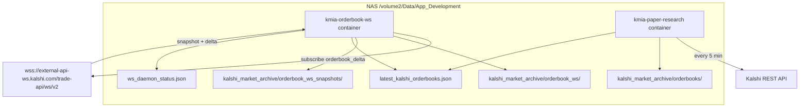

# Kalshi WebSocket orderbook ingest — program design

**Last updated:** 2026-06-22  
**Status:** **Deployed on NAS** (`kmia-orderbook-ws` running)  
**Mode:** Read-only archival — **no order execution**

---

## Purpose

Capture Kalshi orderbook data at the **finest available granularity**: WebSocket `orderbook_delta` (sub-second price-level changes) for all open **KXHIGHMIA** temperature bins. REST 5-minute snapshots in the paper loop remain as fallback.

---

## Architecture



### Console boundaries

| Repo | Owns |
|------|------|
| **Kalshi** (Console 3) | `kalshi_ws_client.py`, `orderbook_ws_state.py`, `orderbook_ws_archiver.py`, `orderbook_ws_daemon.py`, `run_orderbook_ws_daemon.sh` |
| **Console 2** (this repo) | Docker compose `kmia-orderbook-ws`, `run_nas_orderbook_ws.sh`, deploy scripts, archive status, docs |

Integration is **files only** — no cross-repo imports at runtime.

---

## NAS runtime

| Service | Container | Schedule | Command |
|---------|-----------|----------|---------|
| WebSocket archiver | `kmia-orderbook-ws` | Continuous (`restart: unless-stopped`) | `/usr/local/bin/run_nas_orderbook_ws.sh` |
| Paper loop | `kmia-paper-research` | DSM cron `*/5 * * * *` | `/usr/local/bin/run_nas_paper_loop.sh` |
| Policy research | `kmia-paper-research` | DSM cron `30 2 * * *` | `/usr/local/bin/run_nas_policy_pipeline.sh` |

**Compose path:** `/volume2/Data/App_Development/Docker/kmia-paper-research/docker-compose.yml`

### Prerequisites

- Kalshi read-only API credentials on NAS: `/volume2/Data/App_Development/secrets/kmia_paper_research.env`
- Kalshi runtime deployed: `backend/src` + `scripts` under `/volume2/Data/App_Development/Kalshi/`

---

## Data flow

1. **Startup:** REST discover open KXHIGHMIA tickers (`get_all_markets_for_series`).
2. **Subscribe:** `orderbook_delta` for all bins + `market_lifecycle_v2` for rollovers.
3. **On each message:**
   - Append raw event to `orderbook_ws/YYYY-MM-DD.jsonl`
   - Apply snapshot/delta to in-memory book (`orderbook_ws_state.py`)
4. **Every 60s (default):** Write reconstructed full book to `orderbook_ws_snapshots/YYYY-MM-DD.jsonl` and refresh `latest_kalshi_orderbooks.json`.
5. **Heartbeat:** `ws_daemon_status.json` updated on connect, message, and checkpoint.

### Archive record shapes

**Raw WS event** (`orderbook_ws/`):

```json
{
  "archived_at_utc": "...",
  "event_type": "orderbook_snapshot|orderbook_delta|market_lifecycle_v2",
  "sid": 2,
  "seq": 3,
  "payload": { "type": "orderbook_delta", "msg": { ... } },
  "safety": { "no_real_trading": true }
}
```

**Checkpoint snapshot** (`orderbook_ws_snapshots/`):

```json
{
  "archived_at_utc": "...",
  "snapshot_at_utc": "...",
  "market_count": 12,
  "subscribed_tickers": ["KXHIGHMIA-..."],
  "orderbooks": { "TICKER": { "yes_bids": [[cents, size], ...], "top_yes_ask_dollars": 0.25, ... } }
}
```

---

## Configuration

| Variable | Default | Purpose |
|----------|---------|---------|
| `KALSHI_WS_ENABLED` | `true` | Kill switch |
| `KALSHI_WS_SNAPSHOT_INTERVAL_SEC` | `60` | Full-book checkpoint interval |
| `KALSHI_WS_ARCHIVE_RAW_DELTAS` | `true` | Store every delta (finest granularity) |
| `KALSHI_MARKET_ARCHIVE_DIR` | `.../kalshi_market_archive` | Archive root |
| `KALSHI_ARCHIVE_ENABLED` | `true` | Master archive toggle (shared with REST) |

Template: `docker/kmia-paper-research/kmia_paper_research.env.example`

---

## Deploy (Mac → NAS)

```bash
# Console 2 — docker + ingest scripts
NAS_HOST=MediaServer2 ./synology/scripts/deploy_paper_research_to_nas.sh

# Kalshi runtime — WS daemon Python modules
NAS_HOST=MediaServer2 ./synology/scripts/deploy_kalshi_runtime_to_nas.sh

# On NAS — rebuild and start
ssh MediaServer2
cd /volume2/Data/App_Development/Docker/kmia-paper-research
sudo /var/packages/ContainerManager/target/usr/bin/docker compose build
sudo /var/packages/ContainerManager/target/usr/bin/docker compose up -d kmia-orderbook-ws
```

---

## Monitoring

```bash
# Heartbeat + archive inventory
python3 ingest/scripts/kalshi_archive_status.py

# Container logs
sudo docker logs -f kmia-orderbook-ws

# Smoke (includes websockets import + heartbeat age)
sudo docker exec kmia-paper-research /usr/local/bin/smoke_container.sh
```

**Healthy signals (2026-06-22 deploy):** `connected: true`, 12 KXHIGHMIA tickers subscribed, `orderbook_ws/YYYY-MM-DD.jsonl` growing, `seq_gap_count: 0`.

---

## API references

| Spec | Path |
|------|------|
| REST fields | `docs/architecture/KALSHI_API_RESPONSE_FIELDS.md` |
| OpenAPI vendor snapshot | `docs/specs/kalshi_openapi.yaml` |
| WebSocket vendor snapshot | `docs/specs/kalshi_asyncapi.yaml` |
| Collection tiers | `docs/architecture/KALSHI_DATA_COLLECTION.md` |

---

## Phase 2 (not yet implemented)

- Backtest loader reading `orderbook_ws_snapshots/` at prior-day **10 AM ET** anchor
- Multi-level ladder fill simulation in backtest
- Automatic gzip of `orderbook_ws/` older than 90 days

---

## Related docs

- [KALSHI_DATA_COLLECTION.md](KALSHI_DATA_COLLECTION.md)
- [KALSHI_TRADING_BRIDGE_STATE.md](KALSHI_TRADING_BRIDGE_STATE.md)
- [NAS_Runbook.md](../NAS_Runbook.md)
