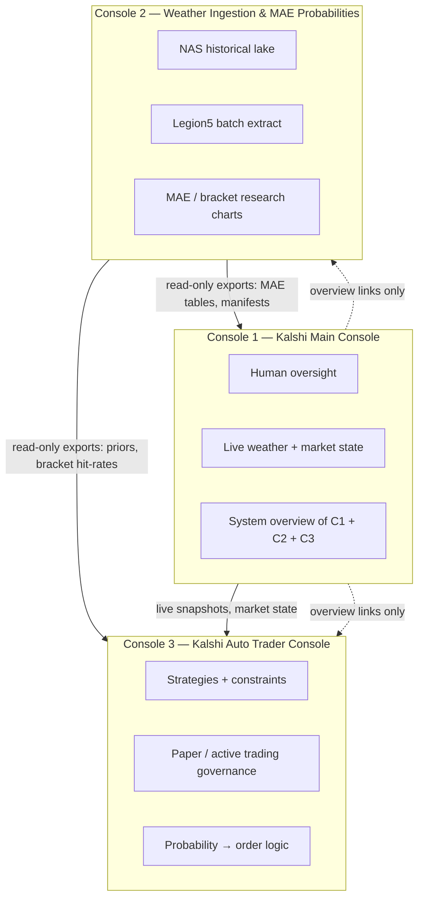

# Three-console architecture — Kalshi KMIA max-temperature system

**Status:** Active governance (2026-06-20)  
**This repository:** **Console 2 only**

Three separate consoles cooperate to support Kalshi KMIA max-temperature betting. They share **data contracts**, not codebases. No console embeds another console’s UI or execution logic.

---

## Overview

| Console | Workspace | Primary audience | Time horizon |
|---------|-----------|------------------|--------------|
| **1 — Kalshi Main** | `/Users/computer/Desktop/App Development/Kalshi` | Human operator | **Live / today** |
| **2 — Weather Ingest & MAE** | `/Users/computer/Desktop/App Development/Synology_KMIA_Ingest_Setup` | Research + batch ops | **Historical archive + research** |
| **3 — Auto Trader** | *Future dedicated module* (may start in `Kalshi/backend`) | Strategy + execution oversight | **Live + paper** |

---

## Console 1 — Kalshi Main Console

**Not in this repo.** Documented here so Console 2 agents do not merge human-console code into ingest.

| Item | Value |
|------|--------|
| Entry point | `Kalshi/backend/src/web_console.py` (Streamlit) |
| Pages | `backend/src/console/pages/` — command center, active forecasts, weather NWS, Kalshi market, paper trading display, backtesting, calibration, system health |
| Role | Full **system overview**: live KMIA weather, Kalshi market visibility, paper-signal review, health — **human-oriented** |
| Safety | `no_real_trading` / `no_order_execution` invariants per `Kalshi/AGENTS.md` |

**Console 1 does not own:** NAS GRIB lake ingest, Legion5 wgrib2 batch, multi-year `accuracy_points_enriched.csv` builds, or the research chart portal.

---

## Console 2 — Weather Ingestion & MAE Probabilities Console

**This repository.**

| Item | Value |
|------|--------|
| Mission | Historical NDFD + ISD ingest, VALID_ONLY extracts, forecast-precision (MAE) analysis, bracket rankings |
| Machines | Mac (deploy/docs) → NAS DS225+ (raw lake) → Legion5 (compute) |
| Primary outputs | `accuracy_points_enriched.csv`, `kmia_chart_suite.html`, `KMIA_Chart_Portal/`, `accuracy_report.md`, merge manifests |
| Chart standard | Golden master methodology (4 PM ET anchor, 0–36h); interactive suite in `ingest/scripts/chart_kmia_interactive_accuracy_explorer.py` |

**Console 2 does not own:**

- Streamlit / `web_console.py` or any human live-dashboard UI
- Kalshi REST trading or order placement
- Paper ledger writes (`paper_trade_ledger`, `PaperLedger`)
- Live NWS/TWC minute-by-minute operator workflows
- Strategy selection or position sizing for bets

**Operating mode:** Research and batch analysis. Treat NDFD as **forecast**, ISD as **observed**. No live trading.

---

## Console 3 — Kalshi Auto Trader Console

**Future / separate module** (not yet a standalone repo in this handoff).

| Item | Intended scope |
|------|----------------|
| Strategies | When to bet, bracket selection, Kelly / edge rules |
| Modes | Paper trading, active trading (gated), constraints |
| Inputs | Live state from Console 1; historical MAE priors from Console 2 |
| Outputs | Orders (when approved), audit trail, constraint violations |

**Console 3 does not own:** Multi-year GRIB backfill, NAS Docker ingest, or the human Streamlit overview (that stays Console 1).

---

## Integration — how consoles work together

### Console 2 → others (publish only)

Console 2 **exports read-only artifacts**. Other consoles **consume** them; they do not import Python from this repo.

| Export | Path (Legion5 example) | Use |
|--------|------------------------|-----|
| Enriched points | `analysis/KMIA_NDFD_AllYears_MaxT_Precision/accuracy_points_enriched.csv` | MAE, ±°F hit-rates, bracket stats |
| Chart portal | `analysis/KMIA_Chart_Portal/kmia_chart_portal.html` | Human research review (link from C1) |
| Per-year studies | `analysis/KMIA_NDFD_Year_MaxT_Precision_*/` | Seasonal / year drill-down |
| Merge manifest | `analysis/KMIA_NDFD_AllYears_MaxT_Precision/all_years_merge_manifest.json` | Coverage truth (date range, n_days) |
| Accuracy report | `accuracy_report.md` | Text summary for operators |
| Trading policy | `Kalshi/backend/data/research/trading_policy.json` (via `export_trading_policy.py`) | Console 3 paper loop: edge, maker limits, insurance, liquidity |
| Kalshi backtest | `Research/.../Kalshi_Price_Backtest/kalshi_price_backtest_*.json` | Policy optimizer input; human trade review text |

Optional future: a small **MAE priors JSON** (bracket × condition × lead-time hit-rates) generated by Console 2 and read by Console 3 — still file-based, no shared code.

**Kalshi bridge state:** `docs/architecture/KALSHI_TRADING_BRIDGE_STATE.md`

### Console 1 → Console 3

Live forecast bins, market snapshots, paper-signal context (`Kalshi/backend` artifact paths under `shared/artifact_paths.py`).

### Console 1 → Console 2

**No write path.** Console 1 may **link** to Legion5 chart portal or synced Research copies for historical context. It does not trigger batch ingest.

---

## Separation rules (mandatory)

1. **One console per workspace** — agents edit the repo that matches the console scope.
2. **No UI mixing** — do not add Streamlit tabs to Console 2 or move `chart_kmia_interactive_accuracy_explorer.py` into `Kalshi/backend/src/console/`.
3. **No execution mixing** — do not add `paper_trading/`, `edge_engine`, or Kalshi order clients to Console 2.
4. **No ingest mixing** — do not add `36_process_all_from_nas.sh`, Docker `kmia-arch-ingest`, or Legion5 wgrib2 batch to Console 1’s live dashboard code paths.
5. **Shared concepts, not shared modules** — golden master *methodology* is shared; golden master *script* lives under Kalshi historical ingest; Console 2 uses compatible chart/analysis scripts in `ingest/scripts/`.
6. **Truth in labels** — multi-year studies must show actual date coverage (see `merge_all_years_enriched.py`), not implied “2020–2025” if data is partial.

---

## Agent routing

| Task | Workspace |
|------|-----------|
| Streamlit dashboard, command center, live NWS | `Kalshi` |
| NAS backfill, Legion5 extract, MAE charts, chart portal | `Synology_KMIA_Ingest_Setup` |
| Strategy engine, paper/auto execution, constraints UI | Console 3 module (TBD) |
| Cross-console overview wiring in Main Console | `Kalshi` only — links + artifact readers |

---

## Related docs (this repo)

- `0_Developer_Source_Files/MISSION.md` — Console 2 mission statement
- `docs/architecture/CONSOLE_2_EXPORT_CONTRACT.md` — export schema and consumers
- `docs/architecture/KALSHI_TRADING_BRIDGE_STATE.md` — trading policy bridge (2026-06-20)
- `.cursor/rules/console-2-boundaries.mdc` — agent enforcement
- `Kalshi/AGENTS.md` — Console 1 invariants (external repo)
